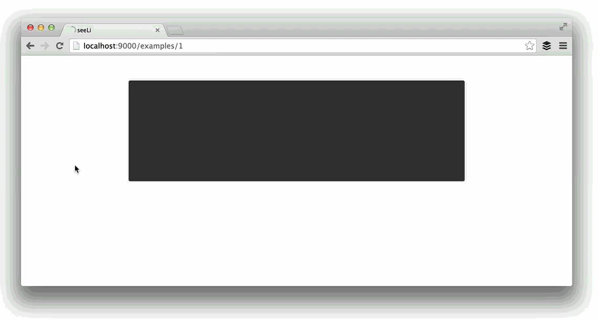

<!--
[](https://github.com/chloi/sightline)

***
-->

# Sightline

Demonstrate your CLI with animated examples.



#### Install With npm

```sh
npm install --save sightline
```

#### Install With Bower

```sh
bower install sightline
```

## Getting started

To run the project locally, clone the project:

```sh
# Clone the project
git clone https://github.com/chloi/sightline

# Move into the project folder
cd sightline
```

Next, install the development dependencies. [Harp](http://harpjs.com) is used to serve the examples.

```sh
npm install
npm start
# Visit the example at http://localhost:9000/examples/1
```

## Contributing

Thanks for considering contributing! There’s information about how to [contribute to Sightline here](CONTRIBUTING.md). Feel free to [send us an email](mailto:kenneth@chloi.io) or [open an issue here](http://github.com/chloi/sightline/issues), too.

## License

[The MIT License (MIT)](LICENSE.md)

Copyright © 2014–2015 [Jorge Pedret](http://jorgepedret.com), [Kenneth Ormandy](http://kennethormandy.com), and [Chloi Inc.](http://chloi.io)
